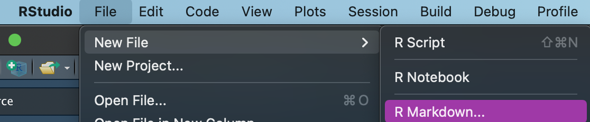
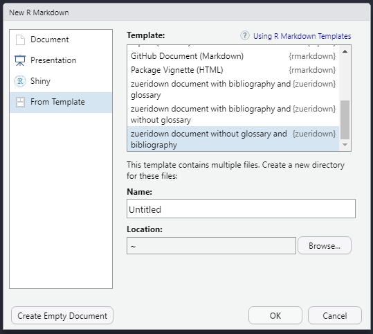
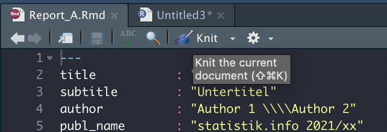
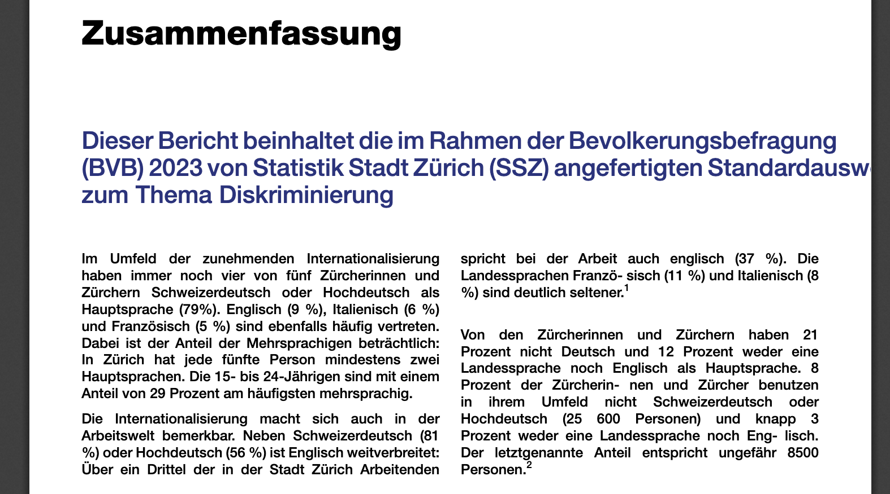
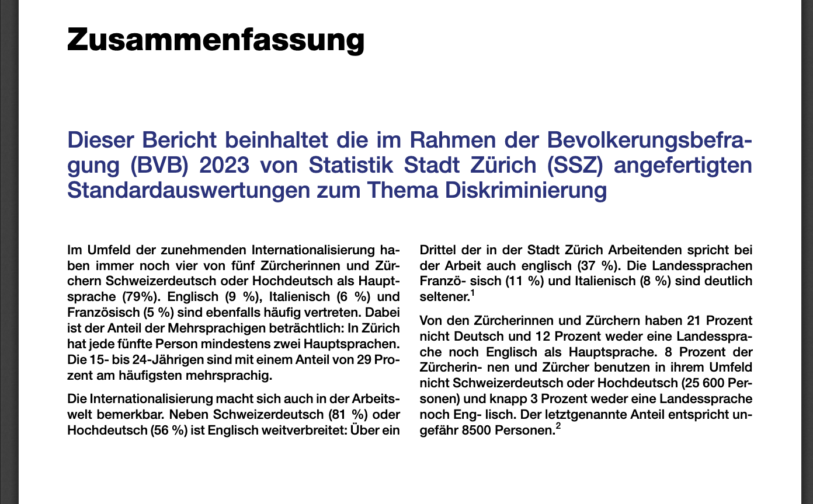

<!-- badges: start -->
[](https://CRAN.R-project.org/package=zueridown)
[](https://cmp-sdlc.stzh.ch/OE-7035/ssz-da/libraries/zueriverse/zueridown/badges/main/pipeline.svg?key_text=GitLabPipeline&key_width=100)
<!-- badges: end -->

# zueridown R Markdown template 

`zueridown` makes it easy to generate customized R Markdown PDF documents that follow the corporate design of the [city of Zurich](https://www.stadt-zuerich.ch/cd/de/index.html). It is based on the CRAN package [indiedown](https://cynkra.github.io/indiedown/), which lays down the framework for customization.

## Installation

### Install tinytex

To create a PDF document using `zueridown` you need some `LaTeX` packages. To install those packages you can install `tinytex` using the following lines of code in R:

``` r
install.packages('tinytex')
tinytex::install_tinytex()
# to uninstall TinyTeX, run tinytex::uninstall_tinytex() 
```

`tinytex` automatically will install all packages needed for `zueridown`. However, if you get an error due to some missing package, you can use the following helper functions:

``` r
library(tinytex)
tlmgr_install('psnfss')      # install the psnfss package
tlmgr_update()   
```

But if you still have some trouble, it is better to use:

``` r
tinytex::reinstall_tinytex()
```

You can find more information on `tinytex` here: <https://yihui.org/tinytex/>

### Install zueridown

#### Install from .tar.gz file

To install from a local source file, store `zueridown_main.tar.gz` at an arbitrary location on your computer.

In R Studio, in the `Packages` pane, click `Install` and select the option `Install from Package Archive File`. Browse to the location of the file and install it. Alternatively, you can download the package from <https://github.com/StatistikStadtZuerich/zueridown>, by clicking `Clone or download`, extract it to any location, e.g., to your Desktop.

Then, run:

``` r
remotes::install_local("<path_to_location>/zueridown-main", dependencies = FALSE)
```

#### Install from GitLab

The package can also be directly installed from here with the appropriate git credentials. If you are already cloning repositories from GitLab, you can simply run:

``` r
remotes::install_git("https://cmp-sdlc.stzh.ch/OE-7035/ssz-da/libraries/zueriverse/zueridown.git")
```

Otherwise you need to create a personal access token in your settings, and use this as a password, together with your GitLab username.

## Basic Template

After installation, a new R Markdown template is available in R Studio. To open, use `File`, `New File`, `R Markdown`.



Click `From Template` and select one of the templates:

-   `zueridown document with glossary and without Bibliography`.
-   `zueridown document with bibliography and glossary`.
-   `zueridown document with bibliography and without glossary`
-   `zueridown document without glossary and bibliography`



After saving the file on your computer, you can use the `Knit` button to produce a basic PDF document based on this template.



## Version

To check your version of `zueridwon`, run:

``` r
packageVersion("zueridown")
```

## Using other packages from the zueriverse

More zueri-specific packages are available on github: [`zueritheme`](https://github.com/StatistikStadtZuerich/zueritheme) provides a ggplot-theme that is styled according to the city's CI/CD, [`zuericolors`](https://github.com/StatistikStadtZuerich/zuericolors) provides the CI/CD colors, and [`zuericssstyle`](https://github.com/StatistikStadtZuerich/zuericssstyle) has css for styling other types of documents such as html.

`zueritheme` and `zuericolors` are automatically installed with `zueridown`.

## FAQ and Troubleshooting

### How to implement Parameterized reports?

You can use [parameters in R Markdown reports](https://bookdown.org/yihui/rmarkdown/params-declare.html) using the `zueridown` template. However, two relevant conditions take place.

First, it is not possible to include in the YAML r calls like `r params$country`. Therefore, if your document has a title or a subtitle using a parameter, you should use the `title` and/or `subtitle` parameters in the function `cd_page_title_box` or `cd_page_title_box` accordingly, for instance:

```         
cd_page_title_box(
  title = paste0("Stadt Zürich: Auswertung", params$country, "verkehrszählstelle", params$Name),
  title_size = "40pt",
  color_palette = cd_color_palette("palette1"),
  )
```

Second, you should use the `zueridown` output format to render the parameterized report. Consequently, after creating a `zueridown` template (for instance: `"report.Rmd"`) use the option `output_format` as in the following example:

```         
  rmarkdown::render(
  input = "report.Rmd",
  output_format = zueridown::zueridown(),
  output_file = "Country_1_report.pdf",
  params = list(country = "Switzerland", Name = "name_1"))
```

### How to implement full width tables?

The option `full_width = T` in `kableExtra` uses the `tabu LaTeX` package, but this package has some problems with colors and other functionalities. To solve this `zueridown` has the function `full_width_tabular` . The function changes the `LaTeX` package `tabu` for `tabularx`. To use it properly follow next steps:

1.  specify the chunk options: ```` ```{r, out.width = "\\textwidth", results='asis', warning=FALSE} ````.
2.  Set in the code of the table `full_width = T`
3.  Add the function `full_width_tabular` at the end of the code table.

**Example**

````         

```{r tab1, out.width = "\\textwidth", results='asis', warning=FALSE}
kableExtra::kable(head(iris),
                  col.names = gsub("[.]", " ", names(iris)),
                  table.env='table',
                  caption = "\\textbf{Titel der Tabelle} \\newline Untertitel der Tabelle",
                  booktabs = T) %>%
            kable_styling(font_size = 9, full_width = T, latex_options = "HOLD_position") %>%
            row_spec(0,bold=TRUE) %>%
            row_spec(2,background="red")  %>%
            full_width_tabular()
```
````

## Issues with Hyphenation or text beyond the margins

If the document does not have proper hyphenation in any line, or there are some texts which extend beyond the margin of the page, i.e. if the document looks like:



Use the commands from the `tinytex` package to install or update the `babel-german` and `hypehn-german LaTeX` packages:

-   `tinytex::tlmgr_install ("babel-german")`
-   `tinytex::tlmgr_install ("hyphen-german")`.

Afterwards your text should contain proper hyphenation, for instance:



## Getting help

If you encounter a bug, please open an issue or contact [statistik\@zuerich.ch](mailto:statistik@zuerich.ch){.email}.
