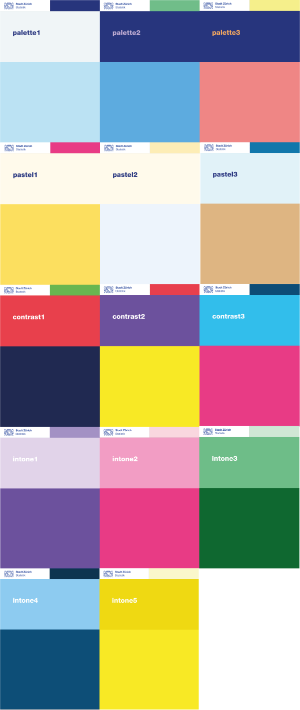

# Color Palettes

There are fourteen color palettes defined.

## Usage

``` r
cd_color_palette(name = "palette1")
```

## Arguments

- name:

  character. Name of the color palette. Default Palette 1.

## Details

The specification of the colors is: 
